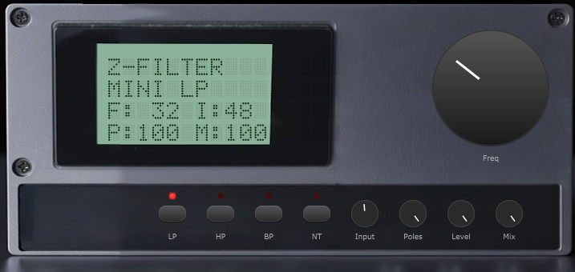

# Z-Filter XL

A dual-filter morphing biquad audio plugin with expanded UI, built with JUCE. Based on the Airwindows Z-series filters by Chris Johnson.


## All Versions

| Z-Filter Mini | Z-Filter | Z-Filter XL |
|:---:|:---:|:---:|
|  |  |  |
| Single filter, no LFO, minimal UI | Single filter, single LFO, compact UI | Dual filter, dual LFO, morph, expanded UI |
| **[Download VST3](https://github.com/sleepingsw0rd/Z-Filter/raw/mini/Releases/Z-FilterMini.vst3/Contents/x86_64-win/Z-FilterMini.vst3)** | **[Download VST3](https://github.com/sleepingsw0rd/Z-Filter/raw/main/Releases/Z-Filter.vst3/Contents/x86_64-win/Z-Filter.vst3)** | **[Download VST3](https://github.com/sleepingsw0rd/Z-Filter/raw/v2-xl/Releases/Z-FilterXL.vst3/Contents/x86_64-win/Z-FilterXL.vst3)** |
| [Documentation](https://github.com/sleepingsw0rd/Z-Filter/tree/mini#readme) | [Documentation](https://github.com/sleepingsw0rd/Z-Filter/tree/main#readme) | *You are here* |

Drop into your VST3 folder (typically `C:\Program Files\Common Files\VST3\`) and scan in your DAW. All three versions can run side-by-side.

## Features

- **Dual Filters (A + B)**: Independent filter type selection with 4 modes each — Lowpass, Highpass, Bandpass, Notch
- **Serial / Parallel Routing**: Chain filters in series (A→B) or run in parallel (A||B)
- **Filter Morphing**: Smoothly blend between Filter A and B with coefficient interpolation
- **Morph LFO**: Dedicated LFO for morph position with tempo sync support
- **Dual LFOs (A + B)**: Independent tempo-syncable LFOs modulating filter cutoff, with LFO Link mode
- **Cascaded Biquad Architecture**: Up to 4 stages per filter (12-48 dB/octave) via independent Poles knobs
- **Z-Output Stage**: Optional Airwindows output processing for analog character
- **Opamp Modeling Stage**: Bandwidth-limited analog op-amp simulation
- **Dot-Matrix LCD Display**: 4-row real-time parameter readout (HD44780 style)
- **Freq Smooth Mode**: Per-sample coefficient recomputation for click-free frequency automation
- **Dry/Wet Mix + Bypass**: Full signal control with LED indicators

## Controls

### FILTERS Section

| Control | Function |
|---------|----------|
| **On** (A / B) | Enable/disable each filter independently |
| **LP / HP / BP / NT** | Filter type quick-select buttons (per row) |
| **Poles** (A / B) | Filter resonance / cascade depth per filter |
| **SER / PAR** | Toggle serial (A→B) or parallel (A\|\|B) routing |

### LFO Section

| Control | Function |
|---------|----------|
| **Spd** (A / B) | LFO speed — free-running Hz or tempo-synced divisions |
| **Dpt** (A / B) | LFO modulation depth |
| **Sync** (A / B) | Toggle tempo sync per LFO |
| **Link** | Link LFO B to LFO A (speed, depth, sync, phase) |

### MORPH Section

| Control | Function |
|---------|----------|
| **On** | Enable morph mode (forces both filters active) |
| **Mrph** | Manual morph position (A↔B blend) |
| **MSpd** | Morph LFO speed |
| **MDpt** | Morph LFO depth |
| **Sync** | Morph LFO tempo sync |

### MASTER Section

| Control | Function |
|---------|----------|
| **Frequency** (large knob) | Master filter cutoff |
| **Input** | Pre-filter input gain |
| **Level** | Post-filter output gain |
| **Mix** | Dry/wet blend |
| **ZOut** | Enable Z-Output stage |
| **Byp** | Bypass all processing |
| **Smth** | Enable freq smooth mode for click-free frequency automation |

## Building

### Requirements

- CMake 3.22+
- C++17 compatible compiler (MSVC, GCC, Clang)
- JUCE 7.0.12 (fetched automatically via CMake)

### Build Steps

```bash
cmake -B build -S .
cmake --build build --config Release
```

Build artifacts:

- **VST3**: `build/ZFilter_artefacts/Release/VST3/Z-FilterXL.vst3`
- **Standalone**: `build/ZFilter_artefacts/Release/Standalone/Z-FilterXL.exe`

## DSP Signal Flow

1. Input gain with hard clip to [-1, 1]
2. Frequency-dependent trim scaling
3. Dual LFO modulation of filter cutoff (per-sample)
4. Morph LFO modulation of morph position (per-sample)
5. Filter processing with coefficient blend morphing
6. Up to 4 cascaded biquad stages per filter (Transposed Direct Form II)
7. Opamp stage: 15.5 kHz lowpass → polynomial soft saturation → 15.5 kHz lowpass
8. Output gain
9. Wet/dry mix blend
10. TPDF dither

## Credits

- **Filter algorithms**: Based on [Airwindows](https://www.airwindows.com/) ZLowpass2, ZHighpass2, ZBandpass2, ZNotch2 by Chris Johnson (MIT License)
- **Framework**: [JUCE](https://juce.com/) 7.0.12

## License

Filter DSP algorithms are derived from Airwindows code, licensed under the MIT License. See `Source/AirwindowsReference/FilterReference.h` for details.
